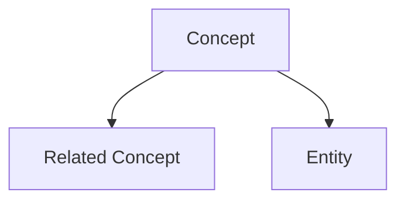

# Schema Template

This file is read by `/wiki:init` and customized for each new wiki.
Replace `{{TOPIC}}`, `{{SCOPE}}`, and `{{CATEGORIES}}` before writing to `schema.md`.

---

# {{TOPIC}} Wiki Schema

## Purpose
This wiki tracks knowledge about **{{TOPIC}}**.

Scope: {{SCOPE}}

## Conventions

### Page Naming
- Filenames: kebab-case, e.g., `reinforcement-learning.md`, `openai.md`
- One concept/entity per page — avoid mega-pages
- If a page grows beyond ~300 lines, consider splitting into sub-topics

### Frontmatter (required on every page)
```yaml
---
title: "Human-Readable Title"
type: entity|concept|source|analysis|overview
tags: [relevant, tags]
created: YYYY-MM-DD
updated: YYYY-MM-DD
sources: [source-slug-1, source-slug-2]
status: stub|draft|solid|comprehensive
---
```

All frontmatter fields are queryable via Dataview. Use consistent tag naming.

### Cross-References — Wikilinks
- **Always use Obsidian wikilinks**: `[[page-name]]` or `[[page-name|Display Text]]`
- Obsidian resolves by filename, no path needed: `[[openai]]` finds `wiki/entities/openai.md`
- Embed images: `![[image-name.png]]`
- Every page should link to at least one other page
- Every page should have at least one inbound link
- When mentioning an entity/concept that has its own page, always link it

### Categories

**entities/** — Things with identity: people, organizations, tools, models, datasets, papers
{{CATEGORIES_ENTITIES}}

**concepts/** — Ideas and techniques: methods, theories, patterns, metrics, terminology
{{CATEGORIES_CONCEPTS}}

**sources/** — One summary per ingested document. Frontmatter includes:
- `source_type`: paper|article|note|report|talk|book|video|podcast
- `authors`: [list]
- `date`: publication date
- `url`: original URL if available
- `key_claims`: [list of main claims/findings]

**analyses/** — Filed query results: comparisons, syntheses, explorations

### Writing Style
- Be precise and concise
- Lead with the most important information
- Use bullet points for lists of facts
- Use tables for comparisons
- Flag uncertainty: use "[uncertain]" or "[needs verification]" when confidence is low
- When sources disagree, present both views with citations via `[[wikilinks]]`

### Contradiction Handling
When new information contradicts existing wiki content:
1. Add a "> [!warning] Contradiction" callout to the relevant page(s)
2. Cite both sources with `[[wikilinks]]`
3. Note which source is more recent/authoritative
4. Update `[[overview]]` if the contradiction is significant

### Image Handling
- All images go to `raw/assets/` (configured in Obsidian vault settings)
- Embed in pages: `![[image-name.png]]`
- After clipping a web article, use `Ctrl+Shift+D` to download remote images locally
- For papers with figures: download key figures to `raw/assets/` with descriptive names

### Mermaid Diagrams
Obsidian renders Mermaid natively. Use for inline diagrams:

````markdown

````

### Obsidian Callouts
Use callouts for special sections:
- `> [!info]` — additional context
- `> [!warning] Contradiction` — conflicting information between sources
- `> [!question]` — open questions to investigate
- `> [!tip]` — key insights

### Dataview Queries
Pages can include Dataview code blocks for dynamic content:

```
TABLE status, length(sources) as "Sources", updated
FROM "wiki/entities"
WHERE status != "comprehensive"
SORT updated DESC
```

## Index Convention
`wiki/index.md` is organized by category. Each entry: `- [[page-name]] — one-line description`

## Log Convention
`wiki/log.md` entries use this format for grep-parseable history:
```markdown
## [YYYY-MM-DD] <operation> | <subject>
- Pages created: <list>
- Pages updated: <list>
- Key changes: <brief summary>
```

Operations: `ingest`, `query`, `timeline`, `ppt`, `lint`, `viz`, `manual-edit`

Useful: `grep "^## \[" wiki/log.md | tail -5` gives last 5 entries.

## Marp Slides Convention
Slide decks live in `ppt/`. Format:
```markdown
---
marp: true
theme: default
paginate: true
---

# Slide Title
Content with [[wikilinks]] for reference

---

# Next Slide
```

Export via Marp CLI: `marp ppt/deck.md --pptx` or `--pdf`
