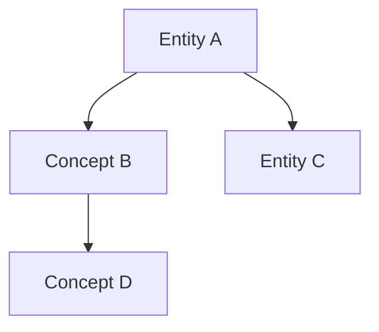

# Wiki Viz

Generate visualizations from wiki data. All outputs saved to `wiki/assets/`.

## Types

| Type | Command | What it shows |
|------|---------|---------------|
| `graph` | `wiki viz graph` | Knowledge graph — entities, concepts, and their `[[wikilink]]` connections |
| `stats` | `wiki viz stats` | 4-panel: pages by category, status distribution, top tags, most connected pages |
| `timeline` | `wiki viz timeline` | Chronological view of source ingestion dates |
| `coverage` | `wiki viz coverage` | Topic coverage heatmap by tag x status (stub/draft/solid/comprehensive) |

## Usage

Run the visualization script:

```bash
python /home/chunyen/.claude/skills/llm-wiki/scripts/wiki_viz.py \
  --wiki-dir <wiki-root>/wiki \
  --type graph \
  --output <wiki-root>/wiki/assets/graph.png
```

Dependencies are auto-installed: `matplotlib`, `networkx`, `pyyaml`.

## After Generation

1. Save the image to `wiki/assets/<type>.png`
2. Embed in a wiki page if useful: `![[assets/graph.png]]`
3. For Mermaid diagrams (simpler, inline): write directly in markdown — Obsidian renders natively



4. Append to `wiki/log.md`:
```markdown
## [YYYY-MM-DD] viz | <type>
- Output: wiki/assets/<type>.png
```

## Tips

- Obsidian's built-in graph view (`Ctrl+G`) shows live structure — use it for browsing
- `wiki viz graph` generates a static PNG for embedding in slides or exports
- Both complement each other: Obsidian graph = interactive; wiki-viz = exportable
